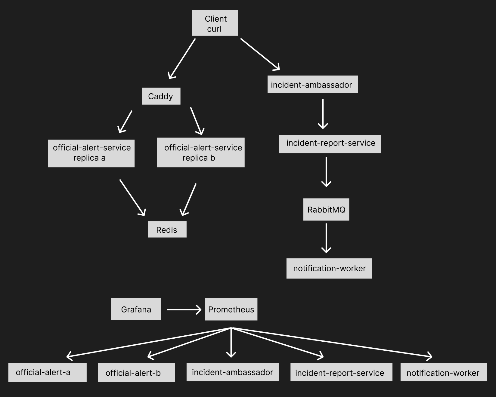

Services

Custom services:

- Official-alert-service: Serves simulated official weather alerts. Two replicas run behind Caddy and share a Redis cache.

- Incident-ambassador: Receives incident-report requests from clients and forwards them to the incident-report-service with retry handling.

- Incident-report-service: Validates and records community incident reports, then publishes notification jobs to RabbitMQ.

- Notification-worker: Consumes incident-notification jobs from RabbitMQ and processes them asynchronously.

Infrastructure services:

- Caddy: Load balances alert requests across the two official-alert-service replicas.

- Redis: Provides the shared cache used by both official-alert-service replicas.

- RabbitMQ: Stores incident-notification jobs between the report service and notification worker.

- Prometheus: Scrapes the `/metrics` endpoint on every custom-service instance.

- Grafana: Uses Prometheus as its provisioned datasource and automatically loads the system overview dashboard.

Services diagram:

